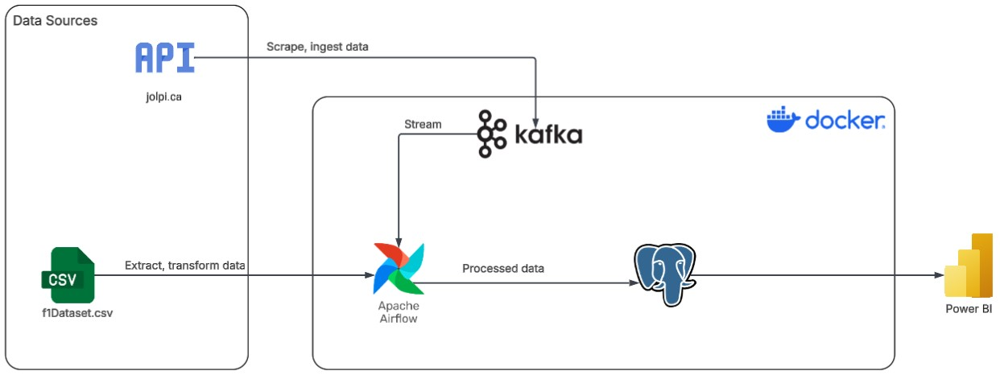
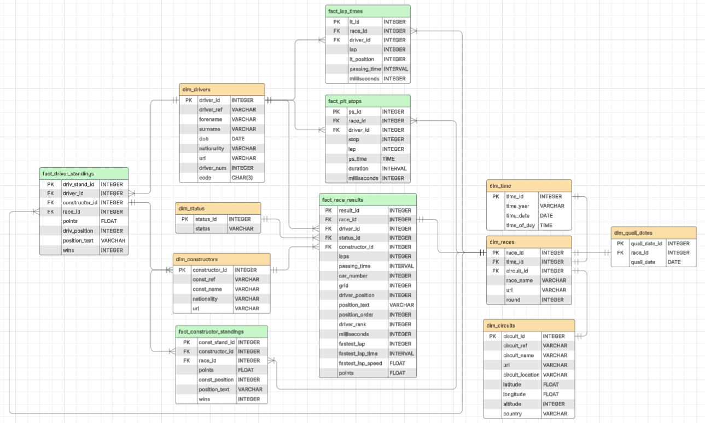
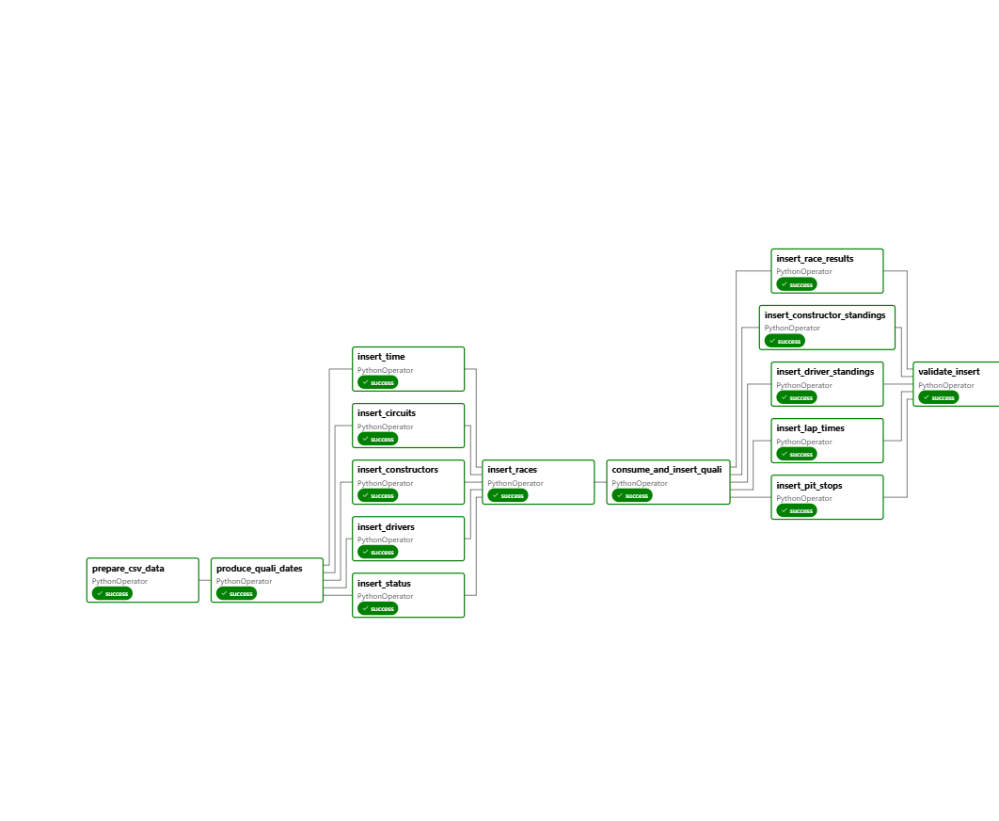
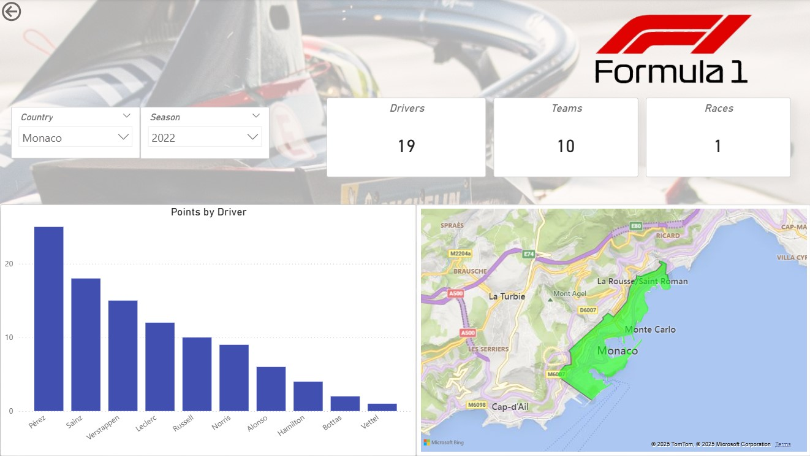
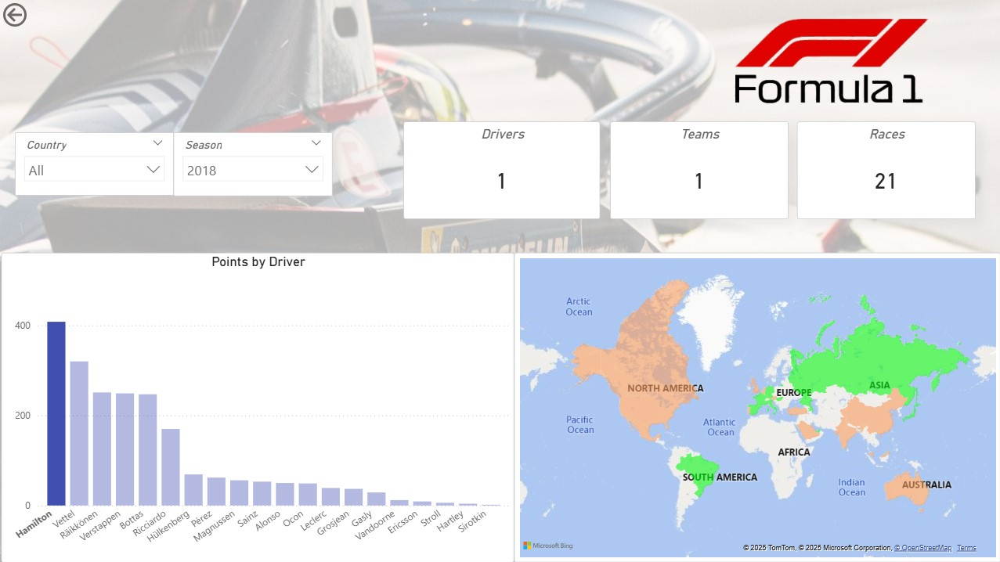
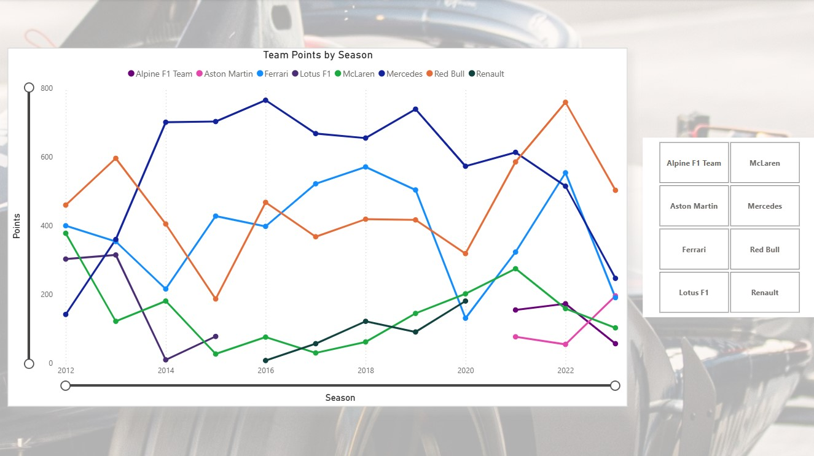
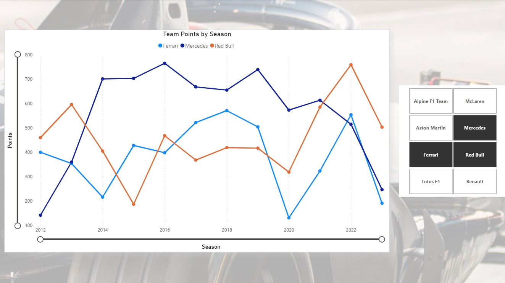
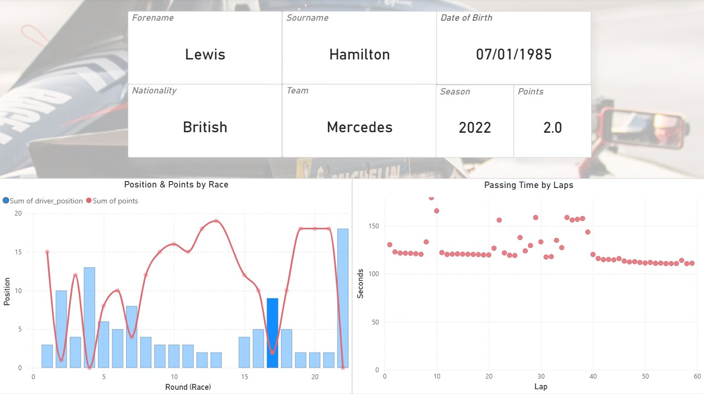

# Formula One Data Pipeline Project

## Overview

This project is a Formula One data pipeline built during my internship at **Vega IT**. It collects various Formula One data from a CSV Dataset, processes using Python, orchestrates the tasks using Apache Airflow, streams additional API data through Apache Kafka, stores data into PostgreSQL, and visualizes insights using Power BI.

---

## Data Sources

### Formula One CSV

#### The main data source is a Formula One CSV file. It contains various Formula One raw data such as: driver, constructor, race, race results, etc. 

- The timeline is **from 2012 up to 2023**. 
- The file is in **.parquet** format
- It is located at **airflow/data/f1Dataset.parquet**

### Formula One API

#### This is a secondary data source, used for integrating additional data into the pipeline (**race qualification dates**) by utilizing **Apache Kafka**

#### The API can be accessed at: https://api.jolpi.ca/ergast/

## Project Folder Structure
```plaintext
f1-data-pipeline/
│── README.md
│── requirements.txt
│── .gitignore
│── __init__.py
│
├── airflow/
│   ├── docker-compose.yaml
│   ├── api/
│   │   └── api_operations.py
│   ├── dags/
│   │   ├── etl_pipeline_dag.py
│   │   └── table_management_dag.py
│   ├── data/
│   │   └── csv_to_parquet.py
│   │   └── f1Dataset.parquet
│   ├── database/
│   │   └── __init__.py
│   │   ├── db_operations.py
│   │   ├── init_db.py
│   │   └── table_management.py
│   ├── models/
│   │   └── __init__.py
│   │   ├── base.py
│   │   └── metadata.py
|
├── docs/
│   ├── diagrams/
│   │   └── data_pipeline_diagram.jpg
│   │   └── erd_1.jpg
│   │   └── erd_v_7.png
│   │   └── erd.jpg
│   ├── dags/
│   │   └── f1_data_pipeline_graph_v_2.png
│   │   └── f1_data_pipeline_graph_v_4.png
│   ├── visuals/
│   │   └── page_1_18_hamilton.jpg
│   │   └── page_1_22_monaco.jpg
│   │   └── page_2_comparison.jpg
│   │   └── page_2_general.jpg
│   │   └── page_3.jpg
|
├── sql/
│   ├── csv_data_import_script.sql
│   └── ddl_script.sql
```

## Technologies Used

* **CSV Dataset / F1 API** – primary and secondary data sources
* **Python** – for ETL, Airflow and Kafka functionalities
* **Apache Airflow** – data pipeline process orchestration
* **Apache Kafka** – real-time streaming (Proof of Concept)
* **PostgreSQL** – data storage
* **SQLAlchemy** – ORM for database interaction
* **Docker** – containerization for Airflow, Kafka, PostgreSQL
* **Power BI** – data visualization and dashboarding

---

## Setup Instructions

### 1. Clone the repository

```bash
git clone https://github.com/stefan-500/f1-data-pipeline.git
cd f1-data-pipeline
```

### 2. Install Docker

* **Windows/Mac:**
  Download and install **Docker Desktop** from [https://www.docker.com/products/docker-desktop](https://www.docker.com/products/docker-desktop).

### 3. Run Containers

```bash
docker-compose up
```
---

## Diagrams

### Architecture


### Entity Relationship Diagram


## DAG

### Data Pipeline DAG


## Visuals

### Driver Standings per Country and Season

#### Monaco Grand Prix Season 2022


#### Season 2018 with Hamilton selected


### Team Standings Timeline

#### Line Chart of Team Points by Season


#### Comparison of Mercedes, Red Bull and Ferrari


### Driver Information and Race Performance Overview for the Season

#### Hamilton's finishing position per race (round) in 2022, with points won, and Passing Time by Laps for the selected race (Singapore Grand Prix 2022)


## Author

Developed by Stefan Vujović during a Data Engineering internship at Vega IT.
